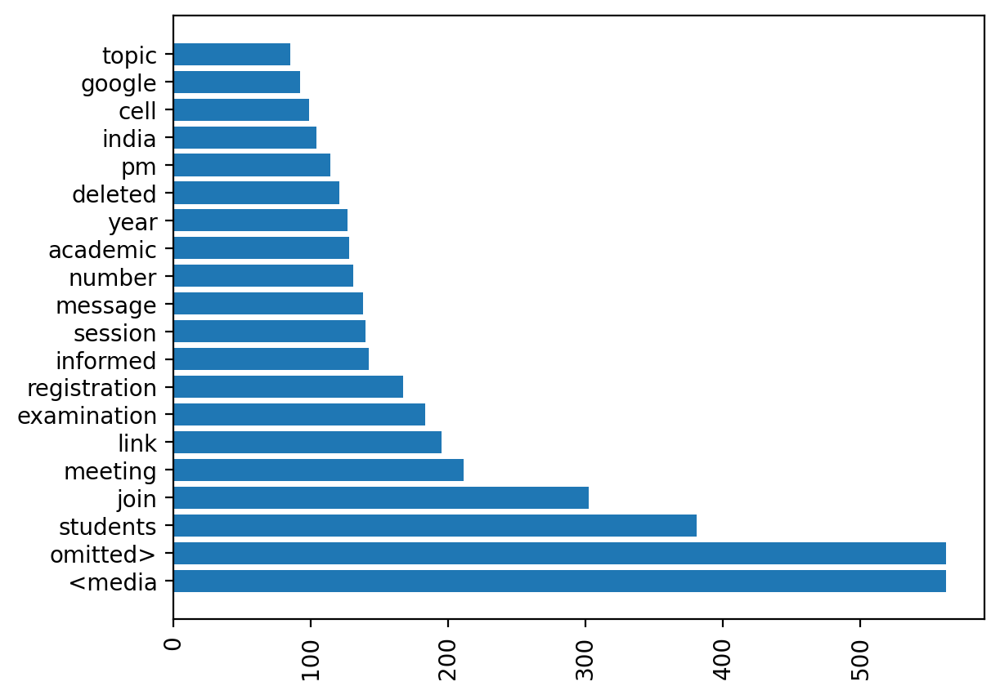

# 📅 WhatsApp Chat Analyzer

Analyze your WhatsApp chat exports to gain deep insights into user activity, emoji usage, communication patterns, and more — all powered by Python and Streamlit! 🚀

---

## 📄 Table of Contents
- [About the Project](#about-the-project)
- [Demo Screenshots](#demo-screenshots)
- [Features](#features)
- [Tech Stack](#tech-stack)
- [Getting Started](#getting-started)
- [Usage Guide](#usage-guide)
- [Future Enhancements](#future-enhancements)
- [Contributing](#contributing)
- [License](#license)
- [Contact](#contact)

---

## 📖 About the Project

The **WhatsApp Chat Analyzer** is a powerful tool that lets you visualize and explore your WhatsApp chat data in a clean and interactive way. Designed for personal insights, data exploration, or just fun, this analyzer helps uncover hidden patterns in conversations like:

- Who chats the most?
- When are people most active?
- How is media shared?
- What emojis are used the most?
- Which words appear frequently?

Whether you're analyzing a group chat or private one-on-one, this tool has you covered.

---

## 📷 Demo Screenshots
All visualizations are dynamically generated. Here's what you can expect:

| Timeline Charts | Emoji Analysis | Activity Heatmaps |
|-----------------|----------------|-------------------|
|  |  |  |

| Most Active Users | Word Cloud | Activity Maps |
|-------------------|------------|----------------|
|  |  |  |
|  |  |  |

---

## ✨ Features

- 📈 **Message Stats**: Total messages, words, media shared, and links.
- 📊 **Timelines**: Daily & monthly activity visualized with clean graphs.
- 🔎 **Most Active Participants**: Message distribution per user in group chats.
- 🌌 **Activity Maps**: Most busy day and month analysis.
- 🛏️ **Heatmaps**: Weekly activity pattern overview.
- ☁️ **Word Cloud**: Visualize the most frequent words used.
- 😃 **Emoji Analysis**: Top emojis and their usage count.
- 📅 **Date Filters** *(coming soon)*: Analyze specific time ranges.

---

## 🚀 Tech Stack

- **Python 3.8+**  
- **Pandas** - for data manipulation  
- **Matplotlib & Seaborn** - for static charts  
- **Streamlit** - to create the interactive UI  
- **WordCloud** - to generate word cloud visualizations  
- **Emoji** - for emoji filtering and stats

---

## 🚧 Getting Started

### Prerequisites
Make sure you have Python 3.8+ installed.

Install the dependencies:
```bash
pip install -r requirements.txt
```

### Clone the Repository
```bash
git clone https://github.com/rohit-ramteke/whatsapp-chat-analyzer.git
cd whatsapp-chat-analyzer
```

### Run the App
```bash
streamlit run app.py
```

---

## 💡 Usage Guide

### How to Export a WhatsApp Chat
1. Open WhatsApp chat (group or individual).
2. Tap on **3-dot menu ⋮ > More > Export Chat**.
3. Choose **"Without Media"** and save the `.txt` file.

### Using the Analyzer
1. Upload your exported `chat.txt` file using the sidebar.
2. Select a user (or choose "Overall").
3. Click **Show Analysis**.
4. Explore all interactive stats and visuals.

### Sample Chat File
If you don’t have a chat ready, try the app with our included `sample_chat.txt` file in the `assets` folder.

---

## 🔮 Future Enhancements
- ✨ Sentiment Analysis using NLP
- 🧠 AI-generated conversation summaries
- 📅 Date range filters
- ✪ Mobile-friendly UI improvements
- 📊 Switch to Plotly for interactive graphs

---

## 💼 Contributing

We welcome contributions!

1. Fork the repo.
2. Create a new branch:
```bash
git checkout -b feature/my-new-feature
```
3. Make changes and commit:
```bash
git commit -m "Add new feature"
```
4. Push to the branch:
```bash
git push origin feature/my-new-feature
```
5. Open a Pull Request.

---

## 📄 License
MIT License. See [LICENSE](LICENSE) for details.

---

## 📧 Contact

- **Creator**: Rohit Ramteke  
- **GitHub**: [rohitramteke1](https://github.com/rohitramteke1)

---

Give this repo a ⭐ if you liked the project and found it useful!

# whatsapp-chat-analyser
